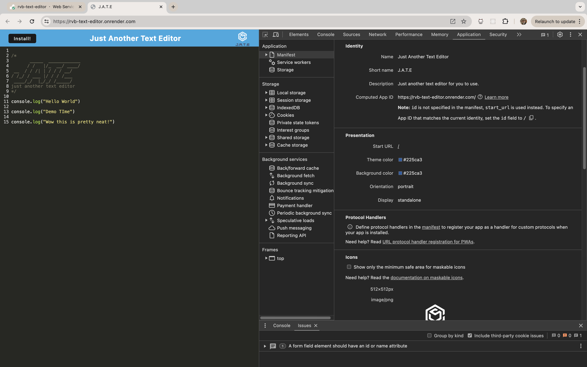
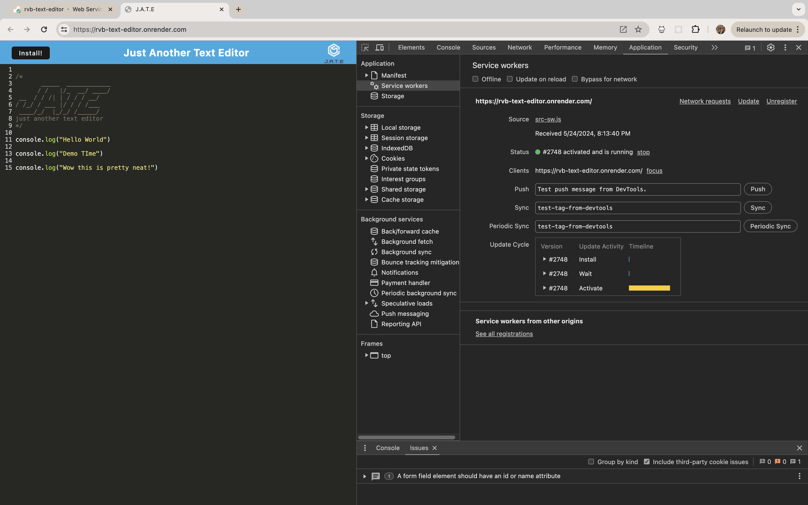
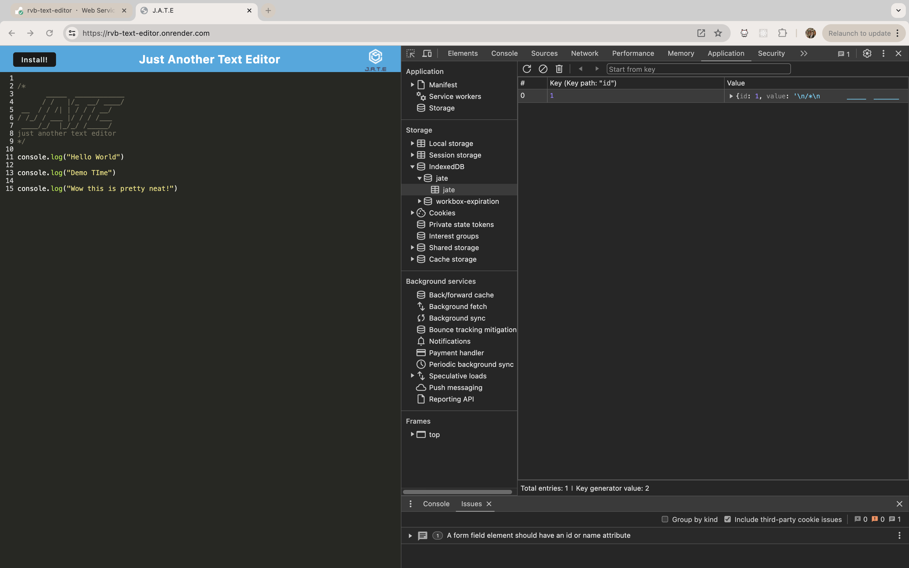

# Text Editor

## Description

This challenge was to build a single-page text editor application that runs in the browser. The single-page application should be up to PWA criteria. The link to the deployed application on Render can be found [here](https://rvb-text-editor.onrender.com/)

## User Story

```md
AS A developer
I WANT to create notes or code snippets with or without an internet connection
SO THAT I can reliably retrieve them for later use
```

## Acceptance Criteria

```md
GIVEN a text editor web application
WHEN I open my application in my editor
THEN I should see a client server folder structure
WHEN I run `npm run start` from the root directory
THEN I find that my application should start up the backend and serve the client
WHEN I run the text editor application from my terminal
THEN I find that my JavaScript files have been bundled using webpack
WHEN I run my webpack plugins
THEN I find that I have a generated HTML file, service worker, and a manifest file
WHEN I use next-gen JavaScript in my application
THEN I find that the text editor still functions in the browser without errors
WHEN I open the text editor
THEN I find that IndexedDB has immediately created a database storage
WHEN I enter content and subsequently click off of the DOM window
THEN I find that the content in the text editor has been saved with IndexedDB
WHEN I reopen the text editor after closing it
THEN I find that the content in the text editor has been retrieved from our IndexedDB
WHEN I click on the Install button
THEN I download my web application as an icon on my desktop
WHEN I load my web application
THEN I should have a registered service worker using workbox
WHEN I register a service worker
THEN I should have my static assets pre cached upon loading along with subsequent pages and static assets
WHEN I deploy to Render
THEN I should have proper build scripts for a webpack application
```

## Table of Contents

* [Description](#description)

* [User Story](#user-story)

* [Acceptance Criteria](#acceptance-criteria)

* [Contributing](#contributing)

* [Screenshot](#screenshot)

* [Questions](#questions)

## Contributing

* [**Vanessa Bou**](https://github.com/rvbouu)
 
 * This assignment consist of starter code that was given to us by our instructor Gary Almes that I debugged and added to in order for the application to work.

## Screenshot

### Gif of Application Functionality


### Screenshot of `manifest.json` file


### Screenshot of application's registered service worker


### Screenshot of application's IndexedDb storage


The link to the deployed application can be found [here](https://rvb-text-editor.onrender.com/).

## Questions

  [GitHub](https://github.com/rvbouu)

  For additional questions or concerns, please email me at rvbouu@gmail.com
